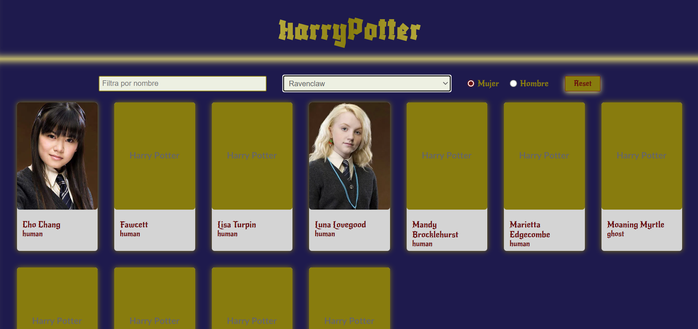
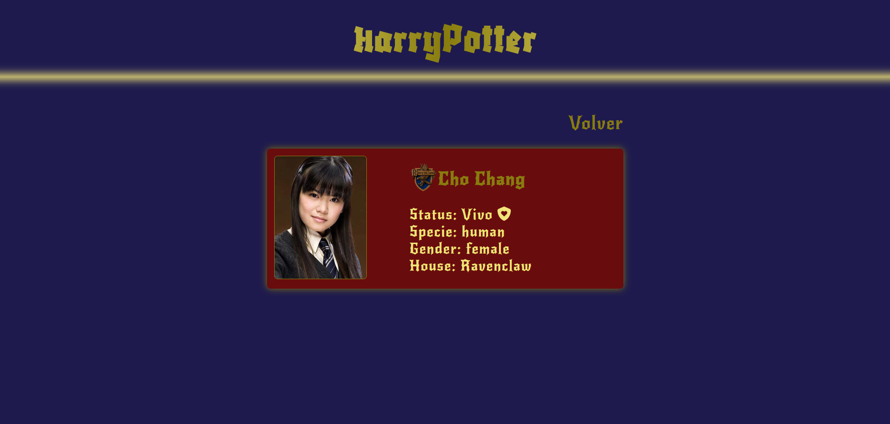

# Harry Potter Characters · React + Vite
[GitHub Pages](https://adalab.github.io/modulo-3-evaluacion-final-JenniferRomanMuerte/)

SPA que lista personajes de Harry Potter, permite filtrarlos y ver el detalle de cada uno con su escudo de casa.

## Demo local
- `npm install`
- `npm run dev`
- Abre el enlace que muestra Vite (por defecto http://localhost:5173).

## Tecnologías
React 19, Vite, React Router, Sass, Font Awesome.

## API
Se consumen los personajes desde `https://hp-api.onrender.com/api/characters/` (`src/services/api.js`) y se normalizan campos básicos (id, name, species, gender, house, image, alive).

## Funcionalidades
- Listado de personajes con tarjeta.
- Filtros por nombre, casa y género.
- Detalle con imagen del personaje y escudo de la casa.
- Fallback de imagen cuando falta foto.
- Spinner de carga mientras llega la API.

## Tarjeta de detalle
- Muestra la foto del personaje (o placeholder si falta).
- Nombre acompañado del escudo de su casa.
- Estado con icono (vivo/🛡️ o muerto/☠️), especie, género y casa.
- Layout responsive: foto a la izquierda y datos a la derecha; en pantallas muy estrechas se apila.

## Estructura rápida
- `src/components` – componentes (tarjetas, filtros, detalle, spinner).
- `src/styles` – estilos Sass.
- `src/services/api.js` – llamada a la API y normalización.
- `src/images` – assets (escudos y capturas).
